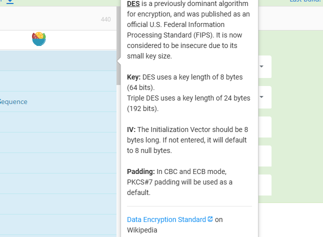
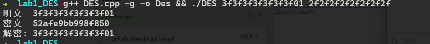
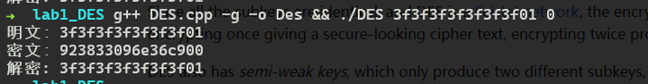
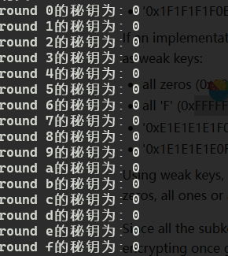
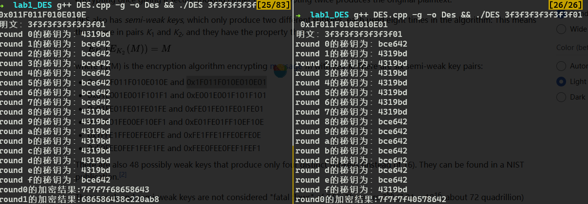
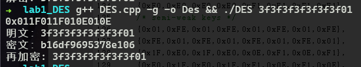

## lab: DES实现

### 原理

密钥首先置换选择，将64bit密钥，选择一些位，化为56位。然后分两半，各自左循环移位，并进行置换选择2，生成对应轮的秘钥。

明文处理有三个阶段，首先初始置换。然后16轮变换，每次轮变换使用相应轮的秘钥。最后是逆初始置换。


### 密钥生成实现

随机定义一个密钥，并定义一些必要的数据结构：初始秘钥，存储16个秘钥的数组，移位数组，pc1表，pc2表

```c

long unsigned k[16];
unsigned shift[16] = {1,1,2,2,2,2,2,2,1,2,2,2,2,2,2,1};

// 8,16...为奇偶校验码
int PC1[8][7] = {
    {57, 49, 41, 33, 25, 17, 9},
    {1, 58, 50, 42, 34, 26, 18},
    {10, 2, 59, 51, 43, 35, 27},
    {19, 11, 3, 60, 52, 44, 36},
    {63, 55, 47, 39, 31, 23, 15},
    {7, 62, 54, 46, 38, 30, 22},
    {14, 6, 61, 53, 45, 37, 29},
    {21, 13, 5, 28, 20, 12, 4}
};
int PC2[8][6] = {
    {14, 17, 11, 24, 1, 5},
    {3, 28, 15, 6, 21, 10},
    {23, 19, 12, 4, 26, 8},
    {16, 7, 27, 20, 13, 2},
    {41, 52, 31, 37, 47, 55},
    {30, 40, 51, 45, 33, 48},
    {44, 49, 39, 56, 34, 53},
    {46, 42, 50, 36, 29, 32}
};
```

为了方便，直接在初始化时将所有所需的秘钥生成，pc1和pc2的细节在最后给出。

```c
// 生成16个密钥
// init
void key_init(unsigned long key){
	// 置换
	unsigned long tempkey = pc1(key);
	// 将key写入l,r
	unsigned l = tempkey >> 28,r = tempkey & ~(-1 << 28);
	cout << "初始密钥：("<<hex << l << ',' << r << ')' << endl;
	
	for(int i=0; i < 16; i++){
		// 循环移位
		l = ((l << shift[i]) & ~0xf0000000) | (l >> (28-shift[i]));
		r = ((r << shift[i]) & ~0xf0000000) | (r >> (28-shift[i]));
		// 置换，并写入key中
		pc2(l,r,i);
		cout << hex << "round "<< i << "的秘钥为："<< k[i] << endl;
	}
}
```

这样就生成了16个秘钥。

### 加密实现

初始替换和逆初始替换。

```c
unsigned long IP(unsigned long m){
	unsigned long ans = 0;
	unsigned long tempshift = 1;
	tempshift <<= 63;

	for(int i=0; i<8; i++){
		for(int j = 0;j < 8; j++){
			ans |= (m & ( (unsigned long)1 << (64-IP_[i][j]) )) == 0 ? 0:tempshift;
			// cout << hex << ans << ' ';
			tempshift >>= 1;
		}
	}
	
	// cout << hex << "message:" << m << "IP:" << ans << endl;
	return ans;
}

unsigned long RIP(unsigned long m){
	unsigned long ans = 0;
	unsigned long tempshift = 1;
	tempshift <<= 63;

	for(int i=0; i<8; i++){
		for(int j = 0;j < 8; j++){
			ans |= (m & ( (unsigned long)1 << (64-IP_1[i][j]) )) == 0 ? 0:tempshift;
			tempshift >>= 1;
		}
	}

	return ans;
}
```

拓展置换

```c
unsigned long ep(unsigned r){
	unsigned long ans = 0;
	unsigned long tempshift = 1;
	tempshift <<= 47;

	for(int i = 0; i<8; i++){
		for(int j = 0; j<6; j++){
			ans |=  (r & ((unsigned long)1 << (32-EP[i][j]))) == 0  ? 0:tempshift;
			tempshift >>= 1;
		}
	}

	// cout <<hex<< "ep:" << ans << endl;

	return ans;
}
```

s盒代换

```c
unsigned long s(unsigned long r){
	unsigned long ans = 0;

	unsigned long tempshift = 0x3f;
	tempshift <<= 42;
	for(int i=0; i<8; i++){
		short t = (r & tempshift) >> ((7-i) * 6);
		// cout << hex << "t:" << t << ' ' << endl;
		// 行坐标
		int x = (t & 0x1) + 2*(!!(t & 0x20));
		// 列坐标
		int y = (t >> 1) & 0xf;

		// cout << hex << "x:" << x << ",y:" << y <<' ' << endl;
		
		ans |= ((unsigned long)S[i][x][y] << ((7-i) * 4));

		tempshift >>= 6;
	}
	// cout << hex << "s:" << ans << endl;

	return ans;
}

```

p代换

```c
unsigned long p(unsigned long r){
	unsigned long ans = 0;
	
	unsigned long tempshift = 1;
	tempshift <<= 31;
	for(int i=0; i<8; i++){
		for(int j = 0; j<4; j++){
			ans |= ( (r & (1 << (32-P[i][j]))) == 0 ? 0:tempshift );
			tempshift >>= 1;
		}
	}

	// cout << hex << "p:" << ans << endl;

	return ans;
}

```

这几个运算的实现都大同小异，利用代换表将位置替换。

解密过程类似，只需要使用相反的秘钥顺序。

### 验证

https://gchq.github.io/CyberChef/ 用于验证算法正确性。



**PKCS7Padding** 是一种常见的填充模式，用于在块加密算法（如 DES 或 AES）中填充数据，使其符合加密算法的块大小要求。下面是其填充规则

[Padding (cryptography) - Wikipedia](https://en.wikipedia.org/wiki/Padding_(cryptography)#PKCS#5_and_PKCS#7)

明文为 ``` 0x3f3f3f3f3f3f3f01```，密钥为 ```0x2f2f2f2f2f2f2f2f``` 



验证


得到了正确结果。

### DES 算法弱秘钥和危害

des算法中弱密钥指的是生成16个相同子秘钥的秘钥。

最容易想到就是``` 0x0000000000``` 和 `0xFFFFFFFFFFFFFFFF`

使用`0x0`作为秘钥加密数据。



打印每轮的秘钥：



可以看到，子密钥皆为0。此时加密算法和解密算法将一模一样。加密两次将得到明文。

还有一种**半弱秘钥**[Weak key - Wikipedia](https://en.wikipedia.org/wiki/Weak_key#Weak_keys_in_DES)，这两个秘钥有如下关系：


选择 `0x011F011F010E010E` 和 `0x1F011F010E010E01`



可以看到 `0x011F011F010E010E`的加密正是 `0x1F011F010E010E01`的解密。

使用这两个秘钥对明文加密。对原来的加密解密过程稍加修改：

```c
int main(int argc,char* argv[]){
	unsigned long key,message;
	if(argc != 3) {
		cout << "Usage:\n "<<argv[0] <<  "<64-bit hex-message>  <64-bit hex-key>" << endl;
		exit(0);
	}
	message = strtoul(argv[1], NULL, 16);
	key = strtoul(argv[2],NULL,16);

	cout << hex << "明文：" << message << endl;

	key_init(key);
	
	unsigned long ciphertext =  DES(message,1);

	cout << hex << "密文：" << ciphertext << endl;

	key = 0x1F011F010E010E01;
	key_init(key);

	unsigned long m = DES(ciphertext,1);

	cout << hex << "再加密: " << m << endl;

	return 0;
}
```

运行得到：



加密两次得到了明文。

### 代码

运行环境：ubuntu 

```c
#include<iostream>
#include<algorithm>

using namespace std;

// long unsigned message = 0x3f3f3f3f3f3f3f01; // 明文
// long unsigned key = 0x2f2f2f2f2f2f2f2f; // 密钥
									
long unsigned k[16];
unsigned shift[16] = {1,1,2,2,2,2,2,2,1,2,2,2,2,2,2,1};

// 8,16...为奇偶校验位，故不出现
int PC1[8][7] = {
    {57, 49, 41, 33, 25, 17, 9},
    {1, 58, 50, 42, 34, 26, 18},
    {10, 2, 59, 51, 43, 35, 27},
    {19, 11, 3, 60, 52, 44, 36},
    {63, 55, 47, 39, 31, 23, 15},
    {7, 62, 54, 46, 38, 30, 22},
    {14, 6, 61, 53, 45, 37, 29},
    {21, 13, 5, 28, 20, 12, 4}
};
int PC2[8][6] = {
    {14, 17, 11, 24, 1, 5},
    {3, 28, 15, 6, 21, 10},
    {23, 19, 12, 4, 26, 8},
    {16, 7, 27, 20, 13, 2},
    {41, 52, 31, 37, 47, 55},
    {30, 40, 51, 45, 33, 48},
    {44, 49, 39, 56, 34, 53},
    {46, 42, 50, 36, 29, 32}
};

// 最右边为第一个bit
unsigned long pc1(unsigned long key){
	unsigned long key1 = 0;

	unsigned long tempshift = 1;
	tempshift <<= 55;
	for(int i=0; i<8; i++){
		for(int j = 0; j<7; j++){
			key1 |= (key & ((unsigned long)1 << (64-PC1[i][j]))) == 0 ? 0:tempshift ;
			tempshift = tempshift>>1;
		}
	}

	return key1;
}

void pc2(unsigned l,unsigned r,int rd){
	unsigned long key1 = 0,key2 = (unsigned long)l;
	unsigned long tempshift = 1;
	tempshift <<= 47;
	
	key2 = (key2 << 28) + r;

	// cout << hex << "置换前密钥："<< key2 << endl;

	for(int i=0; i<8; i++){
		for(int j = 0; j<6; j++){
			key1 |= (key2 & ((unsigned long)1 << (56-PC2[i][j]))) == 0 ? 0:tempshift ;
			tempshift = tempshift>>1;
		}
	}
	k[rd] = key1;

}


// 生成16个密钥
// init
void key_init(unsigned long key){
	// 置换
	unsigned long tempkey = pc1(key);
	// 将key写入l,r
	unsigned l = tempkey >> 28,r = tempkey & ~(-1 << 28);
	// cout << "初始密钥：("<<hex << l << ',' << r << ')' << "key:"<< key << endl;
	
	for(int i=0; i < 16; i++){
		// 左循环移位
		l = ((l << shift[i]) & ~0xf0000000) | (l >> (28-shift[i]));
		r = ((r << shift[i]) & ~0xf0000000) | (r >> (28-shift[i]));
		// 置换，并写入key中
		pc2(l,r,i);
		// cout << hex << "round "<< i << "的秘钥为："<< k[i] << endl;
	}
}
int IP_[8][8] = {
    {58, 50, 42, 34, 26, 18, 10, 2},
    {60, 52, 44, 36, 28, 20, 12, 4},
    {62, 54, 46, 38, 30, 22, 14, 6},
    {64, 56, 48, 40, 32, 24, 16, 8},
    {57, 49, 41, 33, 25, 17, 9, 1},
    {59, 51, 43, 35, 27, 19, 11, 3},
    {61, 53, 45, 37, 29, 21, 13, 5},
    {63, 55, 47, 39, 31, 23, 15, 7}
};

int EP[8][6] = {
    {32, 1, 2, 3, 4, 5},
    {4, 5, 6, 7, 8, 9},
    {8, 9, 10, 11, 12, 13},
    {12, 13, 14, 15, 16, 17},
    {16, 17, 18, 19, 20, 21},
    {20, 21, 22, 23, 24, 25},
    {24, 25, 26, 27, 28, 29},
    {28, 29, 30, 31, 32, 1}
};

int S[8][4][16] = {
    // S1 盒
    {
        {14, 4, 13, 1, 2, 15, 11, 8, 3, 10, 6, 12, 5, 9, 0, 7},
        {0, 15, 7, 4, 14, 2, 13, 1, 10, 6, 12, 11, 9, 5, 3, 8},
        {4, 1, 14, 8, 13, 6, 2, 11, 15, 12, 9, 7, 3, 10, 5, 0},
        {15, 12, 8, 2, 4, 9, 1, 7, 5, 11, 3, 14, 10, 0, 6, 13}
    },
    // S2 盒
    {
        {15, 1, 8, 14, 6, 11, 3, 4, 9, 7, 2, 13, 12, 0, 5, 10},
        {3, 13, 4, 7, 15, 2, 8, 14, 12, 0, 1, 10, 6, 9, 11, 5},
        {0, 14, 7, 11, 10, 4, 13, 1, 5, 8, 12, 6, 9, 3, 2, 15},
        {13, 8, 10, 1, 3, 15, 4, 2, 11, 6, 7, 12, 0, 5, 14, 9}
    },
    // S3 盒
    {
        {10, 0, 9, 14, 6, 3, 15, 5, 1, 13, 12, 7, 11, 4, 2, 8},
        {13, 7, 0, 9, 3, 4, 6, 10, 2, 8, 5, 14, 12, 11, 15, 1},
        {13, 6, 4, 9, 8, 15, 3, 0, 11, 1, 2, 12, 5, 10, 14, 7},
        {1, 10, 13, 0, 6, 9, 8, 7, 4, 15, 14, 3, 11, 5, 2, 12}
    },
    // S4 盒
    {
        {7, 13, 14, 3, 0, 6, 9, 10, 1, 2, 8, 5, 11, 12, 4, 15},
        {13, 8, 11, 5, 6, 15, 0, 3, 4, 7, 2, 12, 1, 10, 14, 9},
        {10, 6, 9, 0, 12, 11, 7, 13, 15, 1, 3, 14, 5, 2, 8, 4},
        {3, 15, 0, 6, 10, 1, 13, 8, 9, 4, 5, 11, 12, 7, 2, 14}
    },
    // S5 盒
    {
        {2, 12, 4, 1, 7, 10, 11, 6, 8, 5, 3, 15, 13, 0, 14, 9},
        {14, 11, 2, 12, 4, 7, 13, 1, 5, 0, 15, 10, 3, 9, 8, 6},
        {4, 2, 1, 11, 10, 13, 7, 8, 15, 9, 12, 5, 6, 3, 0, 14},
        {11, 8, 12, 7, 1, 14, 2, 13, 6, 15, 0, 9, 10, 4, 5, 3}
    },
    // S6 盒
    {
        {12, 1, 10, 15, 9, 2, 6, 8, 0, 13, 3, 4, 14, 7, 5, 11},
        {10, 15, 4, 2, 7, 12, 9, 5, 6, 1, 13, 14, 0, 11, 3, 8},
        {9, 14, 15, 5, 2, 8, 12, 3, 7, 0, 4, 10, 1, 13, 11, 6},
        {4, 3, 2, 12, 9, 5, 15, 10, 11, 14, 1, 7, 6, 0, 8, 13}
    },
    // S7 盒
    {
        {4, 11, 2, 14, 15, 0, 8, 13, 3, 12, 9, 7, 5, 10, 6, 1},
        {13, 0, 11, 7, 4, 9, 1, 10, 14, 3, 5, 12, 2, 15, 8, 6},
        {1, 4, 11, 13, 12, 3, 7, 14, 10, 15, 6, 8, 0, 5, 9, 2},
        {6, 11, 13, 8, 1, 4, 10, 7, 9, 5, 0, 15, 14, 2, 3, 12}
    },
    // S8 盒
    {
        {13, 2, 8, 4, 6, 15, 11, 1, 10, 9, 3, 14, 5, 0, 12, 7},
        {1, 15, 13, 8, 10, 3, 7, 4, 12, 5, 6, 11, 0, 14, 9, 2},
        {7, 11, 4, 1, 9, 12, 14, 2, 0, 6, 10, 13, 15, 3, 5, 8},
        {2, 1, 14, 7, 4, 10, 8, 13, 15, 12, 9, 0, 3, 5, 6, 11}
    }
};


int P[8][4] = {
    {16, 7, 20, 21},
    {29, 12, 28, 17},
    {1, 15, 23, 26},
    {5, 18, 31, 10},
    {2, 8, 24, 14},
    {32, 27, 3, 9},
    {19, 13, 30, 6},
    {22, 11, 4, 25}
};


int IP_1[8][8] = {
    {40, 8, 48, 16, 56, 24, 64, 32},
    {39, 7, 47, 15, 55, 23, 63, 31},
    {38, 6, 46, 14, 54, 22, 62, 30},
    {37, 5, 45, 13, 53, 21, 61, 29},
    {36, 4, 44, 12, 52, 20, 60, 28},
    {35, 3, 43, 11, 51, 19, 59, 27},
    {34, 2, 42, 10, 50, 18, 58, 26},
    {33, 1, 41, 9, 49, 17, 57, 25}
};


unsigned long IP(unsigned long m){
	unsigned long ans = 0;
	unsigned long tempshift = 1;
	tempshift <<= 63;

	for(int i=0; i<8; i++){
		for(int j = 0;j < 8; j++){
			ans |= (m & ( (unsigned long)1 << (64-IP_[i][j]) )) == 0 ? 0:tempshift;
			// cout << hex << ans << ' ';
			tempshift >>= 1;
		}
	}
	
	// cout << hex << "message:" << m << "IP:" << ans << endl;
	return ans;
}

unsigned long RIP(unsigned long m){
	unsigned long ans = 0;
	unsigned long tempshift = 1;
	tempshift <<= 63;

	for(int i=0; i<8; i++){
		for(int j = 0;j < 8; j++){
			ans |= (m & ( (unsigned long)1 << (64-IP_1[i][j]) )) == 0 ? 0:tempshift;
			tempshift >>= 1;
		}
	}

	return ans;
}

unsigned long ep(unsigned r){
	unsigned long ans = 0;
	unsigned long tempshift = 1;
	tempshift <<= 47;

	for(int i = 0; i<8; i++){
		for(int j = 0; j<6; j++){
			ans |=  (r & ((unsigned long)1 << (32-EP[i][j]))) == 0  ? 0:tempshift;
			tempshift >>= 1;
		}
	}

	// cout <<hex<< "ep:" << ans << endl;

	return ans;
}

unsigned long s(unsigned long r){
	unsigned long ans = 0;

	unsigned long tempshift = 0x3f;
	tempshift <<= 42;
	for(int i=0; i<8; i++){
		short t = (r & tempshift) >> ((7-i) * 6);
		// cout << hex << "t:" << t << ' ' << endl;
		// 行坐标
		int x = (t & 0x1) + 2*(!!(t & 0x20));
		// 列坐标
		int y = (t >> 1) & 0xf;

		// cout << hex << "x:" << x << ",y:" << y <<' ' << endl;
		
		ans |= ((unsigned long)S[i][x][y] << ((7-i) * 4));

		tempshift >>= 6;
	}
	// cout << hex << "s:" << ans << endl;

	return ans;
}

unsigned long p(unsigned long r){
	unsigned long ans = 0;
	
	unsigned long tempshift = 1;
	tempshift <<= 31;
	for(int i=0; i<8; i++){
		for(int j = 0; j<4; j++){
			ans |= ( (r & (1 << (32-P[i][j]))) == 0 ? 0:tempshift );
			tempshift >>= 1;
		}
	}

	// cout << hex << "p:" << ans << endl;

	return ans;
}


unsigned long DES(unsigned long m,int en){
	unsigned long ans = m;
	unsigned l,r;
	
	// 初始置换IP
	ans = IP(m);

	l = ans >> 32;
	r = (unsigned)ans;
	// cout << hex<< "-1:" << l << r << endl;
	
	//16次轮函数
	for(int i=0; i<16; i++){
		unsigned long tempr = ep(r);
		if(en)
			tempr = tempr ^ k[i];
		else
			tempr = tempr ^ k[15-i];
		// cout << hex << tempr << endl;
		tempr = s(tempr);
		tempr = p(tempr);
		tempr = tempr ^ l;
		// update
		l = r;
		r = (unsigned)tempr;
		// cout << hex << "round" << i<< "的加密结果:" << l << tempr << endl;
	}

	// 最后交换一次
	ans = (unsigned long)r;
	ans = (ans << 32) | l;
	
	// 逆初始置换
	ans = RIP(ans);

	return ans;
}


int main(int argc,char* argv[]){
	unsigned long key,message;
	if(argc != 3) {
		cout << "Usage:\n "<<argv[0] <<  "<64-bit hex-message>  <64-bit hex-key>" << endl;
		exit(0);
	}
	message = strtoul(argv[1], NULL, 16);
	key = strtoul(argv[2],NULL,16);

	cout << hex << "明文：" << message << endl;

	key_init(key);
	
	unsigned long ciphertext =  DES(message,1);

	cout << hex << "密文：" << ciphertext << endl;

	// key = 0x1F011F010E010E01;
	// key_init(key);

	unsigned long m = DES(ciphertext,0);

	cout << hex << "解密: " << m << endl;

	return 0
```


