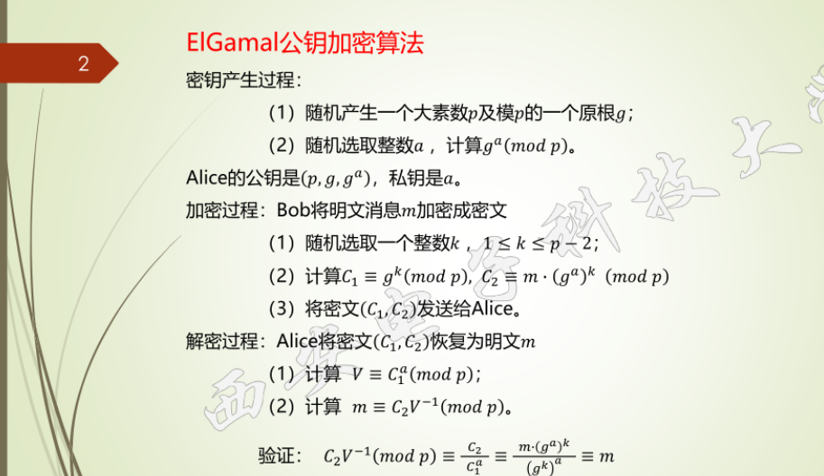
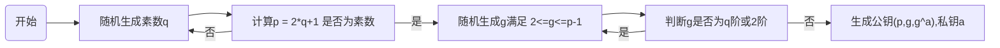
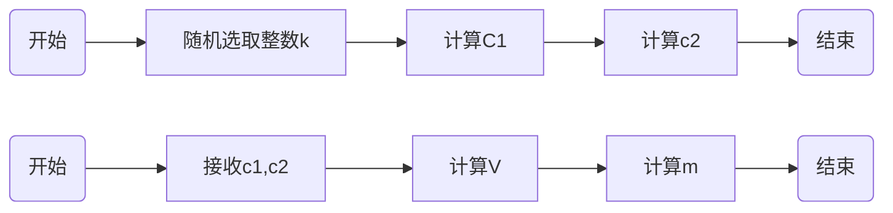

大纲

模指数

模乘

模逆

原理： 离散对数困难问题。

p为素数。

验4测试数据见群文件，请从中选择1个进行测试与数据分析。关于测试数据说明（直接文件读取）：
（1）大素数可用形式为p=2q+1形式的强素数，这里面q也是素数，大素数p和本原根自己生成。（关于强素数，请同学们查阅文献资料了解学习）[强素数 - 维基百科，自由的百科全书](https://zh.wikipedia.org/wiki/强素数)
（2）解密出的结果要与明文作对比，验证解密是否正确。
（3）需显示出中间数据，包括p，g，g^a，k 及密文C=(C1, C2)等

强素数：先生成一个大素数q，然后检测 2*q+1=p是否为素数，则p为强素数

生成元：由于q是素数，则素数p的$Z_n^*$中的元素的阶为2，1，p-1,q。由于p-1较大，故计算另外三个。不满足另外三个的就是原根。

步骤

**流程图**

