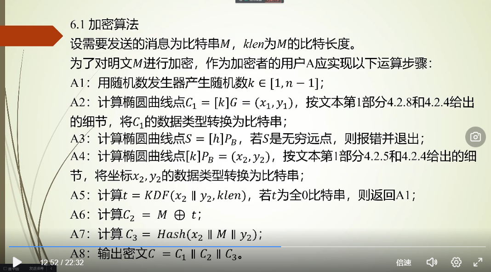
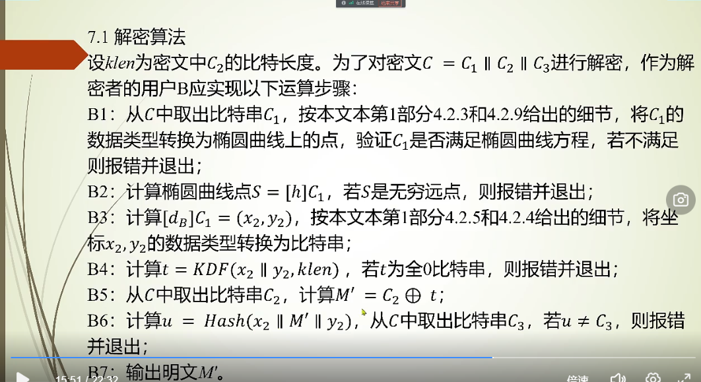
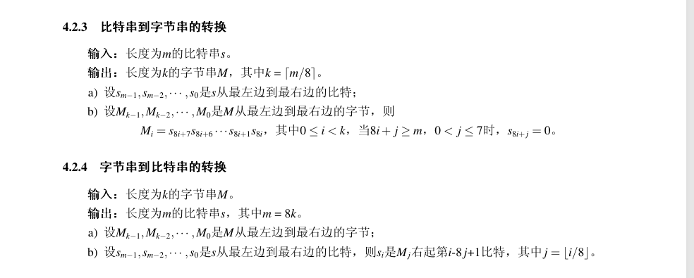
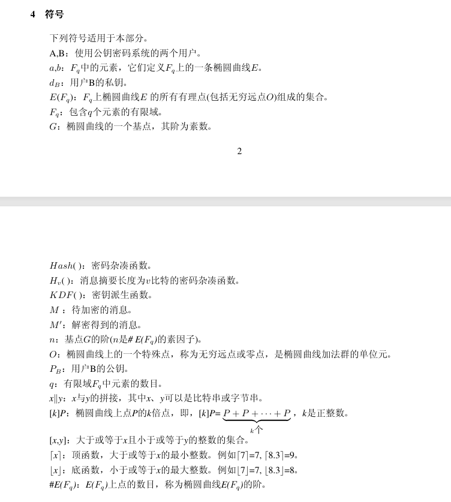

实验5测试数据见群文件，请从中选择1个进行测试与数据分析。关于测试数据说明（直接文件读取）：
（1）椭圆曲线参数，可以用文档例题中的，也可以直接用miracl库里封装的。
（2）Hash函数可以用miracl库里其他Hash函数替代，只要格式合适即可；也可以自己编写SM3。
（3）验收时提供的验收数据，其中包含一段或长或短的英文段落，作为明文。
（4）运行后屏幕显示出必要的椭圆曲线参数，以及明文、对应密文、解密后的明文、是否解密正确等。 
（5）该实验除了提交理论选择题作业、实验报告和代码到西电智课平台，每位同学还必须完成实验室给老师当面验收，才算完成。
（6）本次实验题目安排两周时间完成。

10000100

## sm3 原理

消息填充，分组，拓展。利用初始IV、拓展消息和原始消息，依次迭代压缩。最后得到V_n即结果。

[302a3ada057c4a73830536d03e683110.pdf](https://oscca.gov.cn/sca/xxgk/2010-12/17/1002389/files/302a3ada057c4a73830536d03e683110.pdf)

[sm3算法基本原理-CSDN博客](https://blog.csdn.net/ikantech/article/details/131177567)

注意该算法输出大端序。

如果外部使用小端序，需要进行转换。

## sm2 椭圆曲线公钥密码算法

