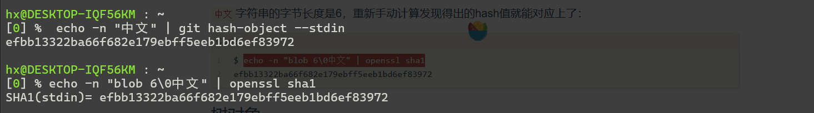
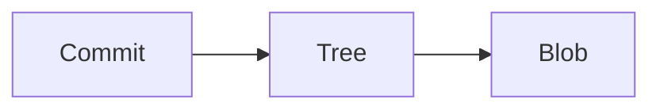
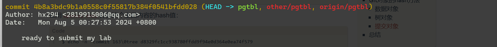
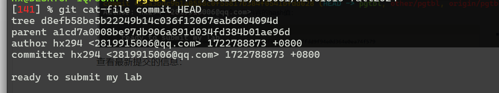
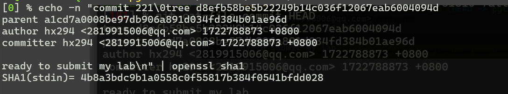
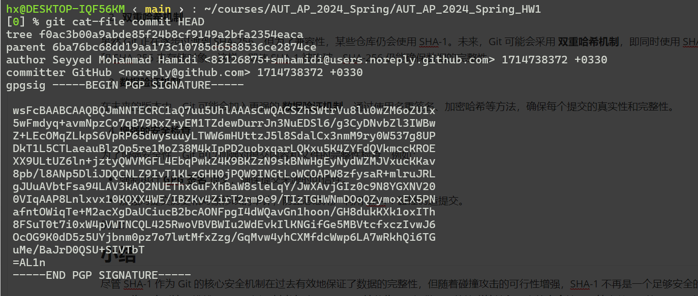

# Git 的内容完整性保护

git中使用了许多密码学原语。在与远程仓库进行交互时，使用SSH进行身份验证。SSH基于**非对称加密**来进行身份验证，从而避免了密码暴力破解。在使用HTTPS协议访问 Git 仓库时，Git 通过 TLS协议对通信过程进行加密，确保数据传输的机密性和完整性。过程中运用了**对称加密**(用于数据加密)，**非对称加密**（共享秘钥）和**数字证书与签名**（验证身份）。git提交时使用了**数字签名**，防止伪造提交和中途篡改。最后，也就是本文的主题，git的内容完整性保护通过**哈希函数**实现。

## 哈希函数

> 散列函数（英语：Hash function）又称散列算法、哈希函数，是一种从任何一种数据中创建小的数字“指纹”的方法。散列函数把消息或数据计算成摘要，使得数据量变小，将数据的格式固定下来。该函数将数据打乱混合，重新创建一个叫做散列值（又叫哈希值）（hash values，hash codes，hash sums，或hashes）的指纹。散列值通常用一个短的随机字母和数字组成的字符串来代表。好的散列函数在输入域中很少出现散列冲突。如果在散列表和数据处理中，不抑制冲突来区别数据，会使得数据库记录更难找到。

git中使用的是SHA-1 哈希算法。



<center>git 使用SHA-1算法 计算blob对象的散列值<center>


### 哈希函数的性质

>  所有散列函数都有如下一个基本特性：如果两个散列值是不相同的（根据同一函数），那么这两个散列值的原始输入也是不相同的。这个特性是散列函数具有[确定性](https://zh.wikipedia.org/wiki/确定性)的结果，具有这种性质的散列函数称为单向散列函数。但另一方面，散列函数的输入和输出不是唯一对应关系的，如果两个散列值相同，两个输入值很可能是相同的，但也可能不同，这种情况称为“[散列碰撞](https://zh.wikipedia.org/w/index.php?title=雜湊碰撞&action=edit&redlink=1)（collision）”，这通常是两个不同长度的输入值，刻意计算出相同的输出值。输入一些数据计算出散列值，然后部分改变输入值，一个具有强混淆特性的散列函数会产生一个完全不同的散列值。

SHA-1具有单向性，抗碰撞性和雪崩效应(原始数据发生很小的改变，生成的哈希值也会发生显著变化）。


<center>例子<center>
## 哈希函数在git内容完整性中的具体应用

**从根本上来讲，Git是一个内容寻址的文件系统，其次才是一个版本控制系统。**记住这点，对于理解Git的内部原理及其重要。所谓“内容寻址的文件系统”，意思是根据文件内容的hash码来定位文件。这就意味着同样内容的文件，在这个文件系统中会指向同一个位置，不会重复存储。

Git对象包含三种：数据对象、树对象、提交对象。在Git中，数据对象相当于文件内容，树对象相当于文件目录树，提交对象则是对文件系统的快照。



<center>简单关系commit、Tree、Blob<center>

具体见[Pro Git 中文版（第二版）](https://www.progit.cn/#_objects)

Git中的数据对象、树对象和提交对象的hash方法原理是一样的，可以描述为：

```
header = "<type> " + content.length + "\0"
hash = sha1(header + content)
```

这里以commit对象作为演示：

提交对象格式：

```
commit <content length><NUL>tree <tree sha>
parent <parent sha>
[parent <parent sha> if several parents from merges]
author <author name> <author e-mail> <timestamp> <timezone>
committer <author name> <author e-mail> <timestamp> <timezone>

<commit message>
```

查看最新提交的哈希值



查看最新提交的信息：



搭配上面给出的格式，可以将commit的提交信息写为如下格式：

```
commit 221\0tree d8efb58be5b22249b14c036f12067eab6004094d
parent a1cd7a0008be97db906a891d034fd384b01ae96d
author hx294 <2819915006@qq.com> 1722788873 +0800
committer hx294 <2819915006@qq.com> 1722788873 +0800

ready to submit my lab

```

最后一个空行不可忽略，或者用转义符替代。



用sha1 哈希就得到了 和上面一样的哈希值。

Git 使用 SHA-1 哈希来确保内容的完整性。具体来说，Git 通过以下方式确保每个对象的完整性：

### 数据完整性验证

Git 使用哈希值验证每个对象的内容完整性。例如，Git 会通过哈希值来确保：

- 提交的内容没有被篡改。
- 文件在不同版本之间没有发生错误。
- 仓库的历史记录没有遭到篡改。

###  防止中途篡改

在分布式版本控制系统中，多个开发者可以对同一个仓库进行操作。Git 通过哈希值确保各个副本之间的**一致性和完整性**，即使在多个开发者之间分发和同步仓库时，也能确保内容未被篡改。

### 防止数据丢失

Git 的设计使得每个对象都有一个唯一的哈希值，并且每个版本的文件都以对象的形式存储，这使得 Git 能够实现高效的 **版本控制**，并且确保文件的每次更改都有明确的标识符。当 Git 遇到数据损坏时，它能够迅速发现并恢复丢失的数据。

## 安全性分析

1. 数据的不可篡改性

- **哈希的单向性**：Git 使用 **SHA-1** 哈希来确保每个对象（如文件、提交、目录等）的内容不可篡改。每个对象都有一个唯一的哈希值，Git 使用这些哈希值来标识对象。在 Git 仓库中，任何对文件内容的修改都会导致新的哈希值，而旧的哈希值会失效。
- **提交历史的不可篡改性**：每个 Git 提交都有一个 **父提交** 和 **树对象**（指向当前提交的目录结构）。这些哈希值串联起来形成一个提交链（类似区块链）。更改任何历史提交都会导致哈希值发生变化，从而导致整个提交历史的变化，容易被检测。

2. 防止篡改和恶意修改 

- **不可预测的对象 ID**：Git 中每个对象（如文件内容、目录结构、提交记录）都通过其内容的哈希值生成一个唯一的 ID，具有 抗碰撞性，即不同的内容不可能有相同的哈希值（除非发生哈希碰撞）。这种机制使得恶意篡改数据变得非常困难。

3. **防止数据丢失**

- Git 的分布式架构意味着每个开发者都有一个完整的本地仓库。即使远程仓库被删除或损坏，本地仓库中的数据仍然存在。因此，Git 的数据冗余机制提供了对数据丢失的天然保护。
- 在本地仓库中，Git 会存储所有的对象和提交历史，并通过哈希值快速检索每个对象。这样，数据丢失的风险较低。

## 潜在漏洞

**SHA-1** 由于其设计存在的漏洞，已经不再被视为完全安全。随着计算能力的提高，攻击者可以使用 **碰撞攻击** 来找到两个不同的输入数据，它们的 **SHA-1 哈希值** 相同。尽管这种攻击需要巨大的计算资源，但它仍然是可能的。

- **影响**：如果攻击者能生成一个与现有提交相同哈希值的恶意提交，就可以伪造数据而不被检测到。例如，恶意用户可能能够修改文件内容并计算出一个与原始文件相同的 SHA-1 哈希值，从而在 Git 仓库中成功篡改内容。
- 应对：
  - Git 已开始向 **SHA-256** 过渡，以应对 SHA-1 的漏洞。通过增强哈希算法的抗碰撞性，SHA-256 提供了更强的数据完整性保护。

### 攻击方式

1. **伪造对象**

攻击者如果能够生成与某个原始 Git 对象相同 SHA-1 哈希值的恶意对象，就可以通过 **碰撞攻击** 实现对象伪造。这使得攻击者能够：

- 伪造提交记录，伪造的提交可能看起来来自某个可信的提交者。
- 伪造文件内容，在不改变文件哈希的情况下替换文件内容。

2. **历史篡改**

通过碰撞攻击，攻击者能够修改 Git 仓库的历史记录，例如修改某个提交的内容而不改变该提交的哈希值。这样，攻击者可以通过篡改历史提交来掩盖恶意行为或错误。

3. **受限的完整性保护**

如果 Git 中的哈希算法存在碰撞漏洞，尽管数据内容可能没有被直接篡改，但由于 Git 是基于 SHA-1 哈希值来验证数据完整性的，因此，碰撞攻击可能导致系统无法有效地检测篡改行为。

### 应对措施

1. **迁移至 SHA-256**

鉴于 SHA-1 存在的安全问题，Git 已开始向 **SHA-256** 迁移。SHA-256 是 SHA-2 系列中的一员，具有更强的抗碰撞性和抗预映像攻击能力。迁移到 SHA-256 后，Git 将能够抵抗基于 SHA-1 的碰撞攻击。值得一提：

- Git 2.29 开始支持 SHA-256，在未来的版本中，SHA-256 将成为 Git 存储对象的默认哈希算法。

2.  **双重哈希机制**

虽然 Git 正在逐步过渡到 SHA-256，但为了兼容性，某些仓库仍会使用 SHA-1。未来，Git 可能会采用 **双重哈希机制**，即同时使用 SHA-1 和 SHA-256 来存储对象。这样，即使 SHA-1 被攻破，SHA-256 仍能确保数据的完整性。

3. **数据验证机制**

在未来的版本中，Git 可能会加入更强的 **数据验证机制**，通过使用多重签名、加密哈希等方法，确保每个提交的真实性和完整性。

4. **增强的安全检查**

为了增强安全性，Git 可以加强对提交内容和文件的完整性检查，例如：

- 强制执行 **GPG 签名** 提交，确保提交来源的可信性。
- 加强对提交历史和对象修改的审计，防止恶意用户利用 SHA-1 碰撞伪造提交。

例如：



<center> 使用gpg签名的例子 <cneter>

## 小结

尽管 SHA-1 作为 Git 的核心安全机制在过去有效地保证了数据的完整性，但随着碰撞攻击的可行性增强，SHA-1 不再是一个足够安全的选项。为了应对这一挑战，Git 正在逐步过渡到 **SHA-256**，这将为 Git 提供更强的抗碰撞性和更高的安全性。尽管当前 Git 的 SHA-1 实现对于大多数攻击者来说仍然是安全的，但考虑到安全形势的变化，Git 的迁移到 SHA-256 将是长期保护仓库数据完整性和防止潜在漏洞的关键步骤。

## 参考链接

[带你全面了解 Git 系列 01 - 深入 Git 原理对大多数程序员同学来说，Git 应该是日常工作中接触的最多的工具 - 掘金](https://juejin.cn/post/6984954259297009678#heading-14)

[Git内部原理之Git对象哈希 - jingsam](https://jingsam.github.io/2018/06/09/git-hash.html)

[Git内部原理之Git对象 - jingsam](https://jingsam.github.io/2018/06/03/git-objects.html)

